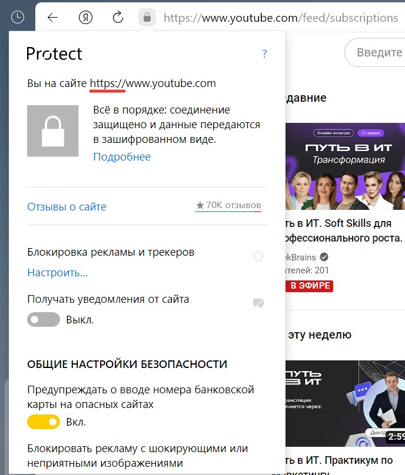
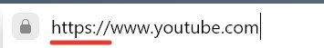
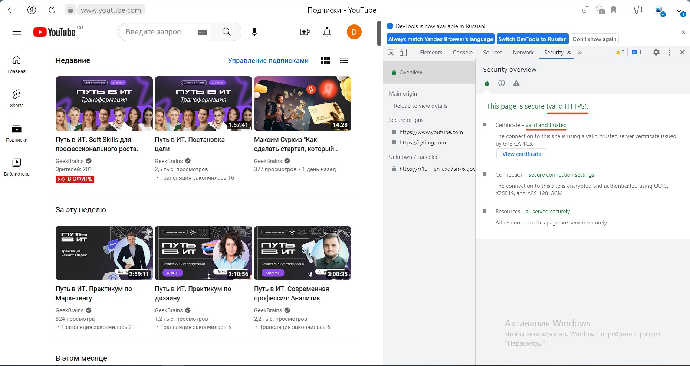
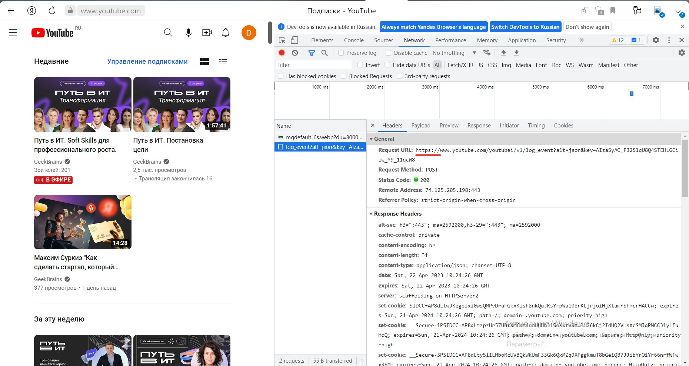

Определение протакола сайта youtube.com

Через адресную строку: 

Через полное наименование адреса сайта:

Через инструменты разработчика в разделе Network:

Через инстременты разработчика в разделе Security:

